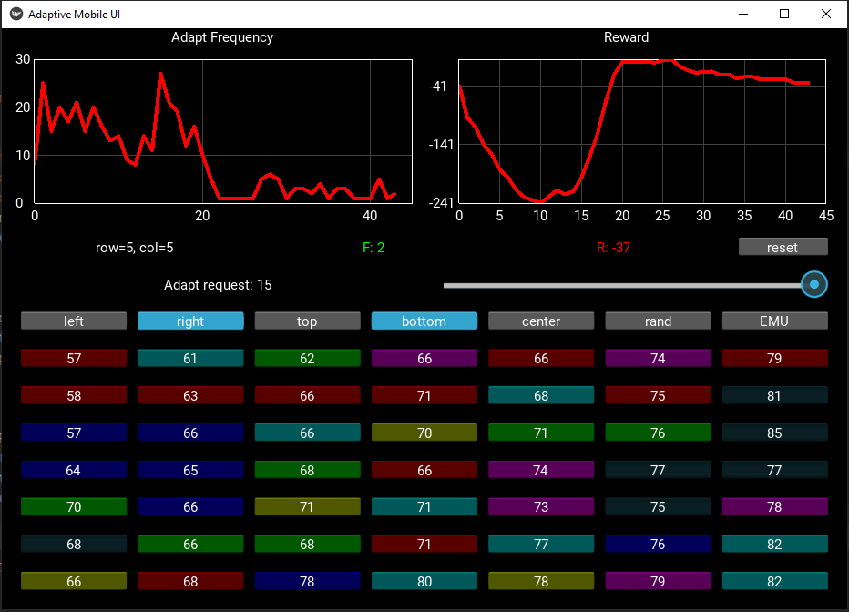

# Adaptive Mobile User Interface based on Machine Learning Model (Multi-agent Reinforcement Learning Approach)
### By Dmitry Vidmanov, Alexander Alfimtsev
#### Copyright (c) 2021 Bauman Moscow State Technical University. All rights reserved.

A simple Kivy Python application that adapts a tiled interface based on the number of clicks (a simple frequency analysis).
The number of clicks on the button is the criterion of adaptation. We adapt the interface by a simple permutation, which varies to bring the buttons with the largest number of clicks closer to one of the 4 corners of the screen. The preferred edge setting is selected using the left, right, top, bottom keys.

Version 0.0.1.6 (28.12.2021)



## Android
You can build for Android using buildozer on Linux.
## Install buildozer

Follow the instructions for your platform [here](https://pypi.org/project/buildozer/) 

Create a new buildozer.spec file or use the example one from the repo.
```
buildozer init
```
Make the following changes to the buildozer.spec file
```
source.include_exts = py,png,jpg,kv,atlas
requirements = python3,kivy
```
Change the architecture you are building for to match that of your device or emulator (f.e. arm64-v8a)
```
android.arch = arm64-v8a
```
Build the APK
```
buildozer android debug
```
and install it with
```
adb install bin/myapp-0.1-x86-debug.apk
```
